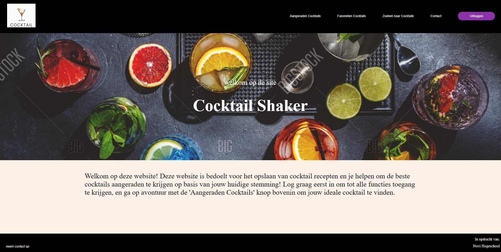

**Installatiehandleiding applicatie Cocktail Shaker**

Welkom in de installatiehandleiding van de applicatie. Deze applicatie kan cocktails opzoeken met behulp van het aanspreken van een derde partij’s API en via een authenticatie principe data opslaan en verkrijgen uit de NOVI backend. De huidige versie is enkel nog lokaal te runnen met behulp van ‘npm run dev’. Je kan op deze applicatie zelf een account aanmaken, cocktails opzoeken op naam, of via een vragenlijst matchende cocktails voorgesteld krijgen.

## Table of Contents
1. [Requirements](#requirements)
2. [API Key](#api-key).
3. [Installatie](#installatie).
4. [Extra npm scripts](#extra-npm-scripts).
5. [Account Aanmaken](#account-aanmaken).

## Requirements

- Webstorm (of een vergelijkbare IDE). Het project is ontworpen en getest in Webstorm
- Node.js. Gebruik hiervoor de prebuilt installer.
- Een API Key om de cocktaildata op te halen van een externe API

## API Key 

Via de ingebouwde environment-variables kun je eenvoudig een eigen API Key toevoegen aan het project nadat je deze hebt aangemaakt. Maak deze eerst aan via de volgende stappen:

1. Ga naar [TheCocktailDB API](https://www.thecocktaildb.com/api.php) en meld je aan voor een API-sleutel, of pak de gratis versie van de site.
2. Zodra je de API-sleutel hebt, maak je een `.env`-bestand in de hoofdmap van het project.
3. Voeg de volgende regel toe aan he `.env`-bestand. Dit zal er dan als volgt uitzien: API_KEY=De API Key
4. Wegens een technische fout werkt de '.env' import niet voor SignUp.jsx. Hierin zal je handmatig de API_Key moeten zetten in "[plaats de API key hier]". 

Er is een testdatabase met een API Key aangemaakt voor gebruikersvriendelijkheid. De Key hiervan is: cocktailshaker:02gWTBwcnwhUwPE4NIzm

## Installatie

1. Open je IDE
2. Clone de applicatie vanaf de github repository door in je IDE te kiezen voor VCS, dan Get from version control en plak vervolgens de link naar de Github: https://github.com/Gitaccount821/Frontend-eindproject-cocktails
3. Installeer Node.js
4. Start de computer opnieuw op
5. Herstart je IDE
6. Open de terminal en run ‘npm install’
7. Binnen de terminal, run nu het command ‘npm run dev’
8. Ga naar de aangemaakte localhost

## Extra npm scripts

Naast de bovenstaande stappen zijn er enkele andere npm-scripts die je kunt gebruiken:

1) npm run dev: Start de ontwikkelserver met hot module replacement (HMR) voor snelle ontwikkeling.
2) npm run build: Bouwt de applicatie voor productie. Dit genereert de geoptimaliseerde bestanden die in de productieomgeving kunnen worden ingezet.
3) npm run lint: Voert ESLint uit op de bronbestanden om codekwaliteit en consistentie te waarborgen.
4) npm run preview: Start een preview-server om de gebouwde versie van de applicatie te bekijken.

## Account Aanmaken

Je kan een account aanmaken via de login knop, en vervolgens te klikken op ‘creeer een account’. Er is ook al een testaccount aanwezig met de credentials indien je de testdatabase APi key gebruikt:

_Gebruikersnaam:_ testuser1234

_Wachtwoord:_ testuser1234
